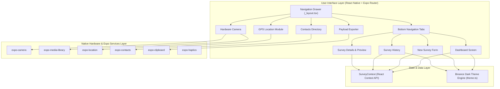
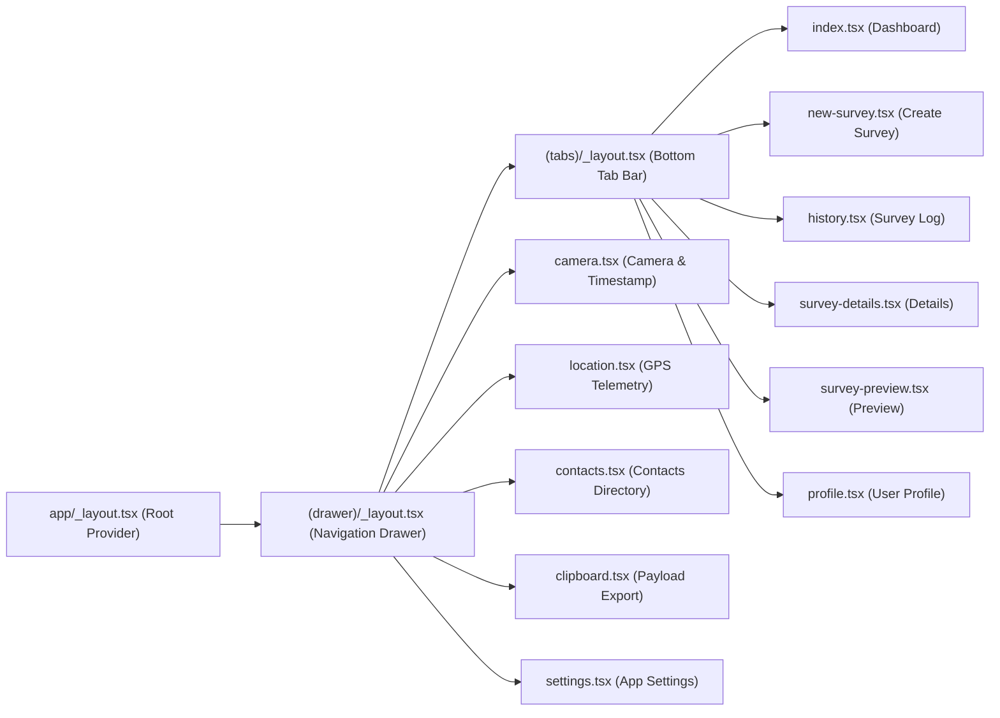
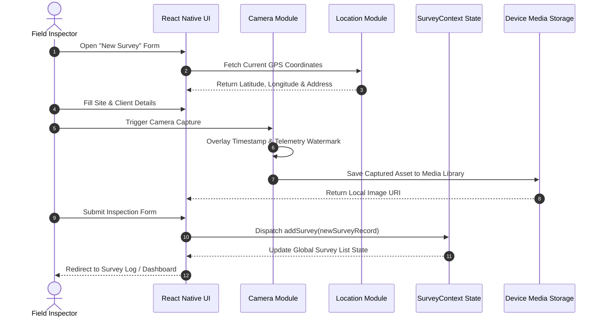

# 📱 Smart Field Survey & Inspection App

[](https://reactnative.dev/)
[](https://expo.dev/)
[](https://www.typescriptlang.org/)
[](https://docs.expo.dev/router/introduction/)
[](LICENSE)

An enterprise-grade, high-precision cross-platform mobile application designed for field survey engineers, site inspectors, and auditor teams. Built with **React Native**, **Expo SDK 54**, **TypeScript**, and **Expo Router**, featuring a premium **Binance-Inspired Dark Theme UI/UX** optimized for field visibility, data accuracy, and hardware integration.

---

## 🌟 Key Features & Functional Modules

### 📊 1. Survey Dashboard & Analytics
- **Live Telemetry & Metrics**: Real-time counter of total inspections, pending high-priority reviews, completed reports, and active field tasks.
- **Recent Survey Feed**: Quick-scroll inspection stream with status indicators, priority tags, timestamp metrics, and fast contextual actions.
- **Quick Navigation Hub**: One-tap access to primary field operations (New Inspection, Camera Capture, GPS Tagging, Stakeholder Directory).

### 📝 2. Field Survey Creator & Validation
- **Structured Inspection Entry**: Forms for site name, client details, inspection priority (High, Medium, Low), execution date, and detailed audit notes.
- **Form Validation Engine**: Low-level input verification ensuring valid site identifiers and payload integrity before persistence.
- **Dynamic Context Linkage**: Seamless integration with captured GPS coordinates, timestamped photo evidence, and linked contact personnel.

### 📋 3. Survey Logs & Details Management
- **Audit Log History**: Full list view of archived and active surveys.
- **Search & Filter Controls**: Real-time filtering by priority status, date range, or client queries.
- **Detailed Inspection Breakdown**: Deep-dive inspection view showcasing raw payload metadata, site location details, and photo assets.
- **Record Deletion & Management**: Controlled deletion and state updates via global React Context API.

### 📷 4. Hardware Camera & Watermark Overlay Module
- **Native Camera Interface**: Direct integration with `expo-camera` supporting front/back camera toggling, flash controls, and focus locks.
- **Timestamp & Telemetry Watermarking**: Real-time visual overlay on captured photos recording inspection timestamp, site ID, and GPS coordinates.
- **Persistent Media Library Storage**: Automatically saves high-resolution inspection media to device gallery using `expo-media-library`.

### 📍 5. GPS Location & Telemetry Module
- **Real-Time Position Tracking**: Powered by `expo-location` with high-accuracy GPS satellite positioning.
- **Geographic Data Telemetry**: Precise extraction of Latitude, Longitude, Altitude, Heading, and Accuracy margins.
- **Reverse Geocoding**: Automatic translation of raw coordinates into human-readable street addresses and site locations.

### 👥 6. Stakeholder & Contacts Directory
- **Device Contact Synchronization**: Reads client and field crew contact lists using `expo-contacts`.
- **Searchable Personnel Directory**: Instantly locate project managers, site supervisors, and client representatives.
- **One-Tap Assignment**: Link contacts directly to field inspection records.

### 📋 7. Data Clipboard & Payload Exporter
- **Inspection Data Serialization**: Convert complex survey records into structured JSON payloads.
- **Quick Clipboard Sharing**: `expo-clipboard` integration for instant copying and sharing across communication channels (Slack, Email, WhatsApp).

### 🎨 8. Binance-Inspired Dark Design System
- **High-Contrast Dark Aesthetic**: Crafted with rich canvas dark base (`#0B0E11`), surface cards (`#1E2329`), and Binance Yellow accenting (`#FCD535`).
- **Monospace Typography Scale**: Precision numerical formatting (`monospace`) for coordinate readings, timestamps, and survey IDs.
- **Micro-Animations & Haptics**: Smooth transitions using `react-native-reanimated` and tactile feedback via `expo-haptics`.

---

## 🏗️ System Architecture

### High-Level Architecture Diagram



---

## 🧭 Navigation & Routing Structure

The application utilizes **Expo Router v6** for type-safe, file-based routing combining nested **Drawer** and **Bottom Tab** navigation structures.



---

## 🔄 Survey Data Lifecycle Flow



---

## 📁 Repository Directory Structure

```
Smart-Field-Survey-Inspection-App/
├── app/                        # Expo Router Navigation & Screen Hierarchy
│   ├── (drawer)/               # Main Drawer Navigation Layout
│   │   ├── (tabs)/             # Nested Bottom Tab Navigation Layout
│   │   │   ├── _layout.tsx     # Tab Navigation Configuration & Icons
│   │   │   ├── history.tsx     # Inspection History Log & Search
│   │   │   ├── index.tsx       # Primary Dashboard & Analytics View
│   │   │   ├── new-survey.tsx  # Dynamic Survey Creation Form
│   │   │   ├── profile.tsx     # Inspector Profile & Preferences
│   │   │   ├── survey-details.tsx # Individual Survey Inspection Detail
│   │   │   └── survey-preview.tsx # Survey Snapshot & Export Preview
│   │   ├── _layout.tsx         # Drawer Navigation Configuration & Side Menu
│   │   ├── camera.tsx          # Hardware Camera & Watermarking Screen
│   │   ├── clipboard.tsx       # JSON Data Export & Clipboard Utility
│   │   ├── contacts.tsx        # Device Contact Integration & Directory
│   │   ├── location.tsx        # GPS Telemetry & Mapping Details
│   │   └── settings.tsx        # System Preferences & Theme Settings
│   ├── context/
│   │   └── SurveyContext.tsx   # React Context State Management Provider
│   ├── _layout.tsx             # Root Application Layout & Context Wrapper
│   └── modal.tsx               # Utility Modal Dialog Route
├── components/                 # Reusable UI Components System
│   ├── ui/                     # System UI Atoms & Molecules
│   ├── external-link.tsx       # External Web Link Component
│   ├── haptic-tab.tsx          # Haptic Feedback Tab Bar Button
│   ├── hello-wave.tsx          # Animated Welcome Component
│   ├── parallax-scroll-view.tsx# Parallax Scrolling Header Container
│   ├── themed-text.tsx         # Themed Typography Component
│   └── themed-view.tsx         # Themed Background View Container
├── constants/
│   └── theme.ts                # Binance Design System Colors, Fonts & Spacing
├── hooks/                      # Custom React Hooks
│   ├── use-color-scheme.ts     # Dark / Light Theme Color Hook
│   └── use-theme-color.ts      # Tokenized Theme Color Getter
├── assets/                     # Static Image, Icon & Font Assets
│   └── images/                 # App Logos, Icons, and Watermark Graphics
├── scripts/                    # Build & Utility Scripts
├── app.json                    # Expo Project Configuration & Permissions Manifest
├── package.json                # Dependencies, Scripts, and Metadata
├── tsconfig.json               # TypeScript Configuration Matrix
└── README.md                   # Project Documentation
```

---

## 🎨 Binance-Inspired Design Tokens

| Token Category | Token Name | Hex / Value | Description |
| :--- | :--- | :--- | :--- |
| **Canvas** | `canvasDark` | `#0B0E11` | Primary Application Background (Ultra Dark) |
| **Card Surface** | `cardDark` | `#1E2329` | Container Cards & List Item Backgrounds |
| **Elevated Surface**| `surfaceElevated` | `#2B3139` | Hover States, Modals & Floating Components |
| **Primary Accent** | `primaryYellow` | `#FCD535` | Binance Gold Accent Color for CTAs & Highlights |
| **Active Accent** | `primaryActive` | `#F0B90B` | Pressed State Accent |
| **Success Status** | `tradingUpGreen` | `#0ECB81` | Completed Inspection & Low Priority Tags |
| **Danger Status** | `tradingDownRed` | `#F6465D` | High Priority Alerts & Deletion Actions |
| **Typography** | Monospace | `Courier New / monospace` | Used for Geolocation, Timestamps & IDs |

---

## ⚙️ Native Mobile Permissions Matrix

The app leverages native device hardware capabilities configured in `app.json`:

| Hardware Service | Expo Module | Required Permission Prompt | Use Case |
| :--- | :--- | :--- | :--- |
| **Camera** | `expo-camera` | `CameraPermission` | Real-time photo capture during site inspection |
| **Media Storage** | `expo-media-library` | `MediaLibraryPermission` | Saving timestamped inspection images to gallery |
| **GPS Location** | `expo-location` | `LocationPermission` | Geotagging survey entries with Lat/Long/Alt |
| **Contacts** | `expo-contacts` | `ContactsPermission` | Synchronizing device contacts for stakeholder linking |

---

## 🚀 Getting Started

### Prerequisites

Ensure you have the following installed on your development machine:
- **Node.js**: `v18.0.0` or higher
- **npm** (v9+) or **yarn** or **pnpm**
- **Expo Go App** on iOS / Android device (optional for physical device testing)
- **Android Studio** (for Android Emulator) or **Xcode** (macOS only, for iOS Simulator)

### Installation

1. **Clone the Repository**
   ```bash
   git clone https://github.com/atulXdev/Smart-Field-Survey-Inspection-App.git
   cd Smart-Field-Survey-Inspection-App
   ```

2. **Install Dependencies**
   ```bash
   npm install
   ```

3. **Start the Expo Development Server**
   ```bash
   npx expo start
   ```

### Running on Devices & Emulators

- **Android Emulator**: Press `a` in the terminal or run `npm run android`
- **iOS Simulator**: Press `i` in the terminal or run `npm run ios` (macOS only)
- **Web Browser**: Press `w` in the terminal or run `npm run web`
- **Physical Device**: Scan the generated QR code in your terminal using the **Expo Go** app.

---

## 📦 Building for Production

### Build APK / AAB for Android via EAS

1. Install EAS CLI:
   ```bash
   npm install -g eas-cli
   ```
2. Log in to your Expo account:
   ```bash
   eas login
   ```
3. Configure build profile and trigger Android build:
   ```bash
   eas build --platform android --profile preview
   ```

---

## 🤝 Contributing

Contributions, issues, and feature requests are welcome! Feel free to check the [issues page](https://github.com/atulXdev/Smart-Field-Survey-Inspection-App/issues).

1. Fork the Repository
2. Create your Feature Branch (`git checkout -b feature/AmazingFeature`)
3. Commit your Changes (`git commit -m 'Add some AmazingFeature'`)
4. Push to the Branch (`git checkout -b feature/AmazingFeature`)
5. Open a Pull Request

---

## 📜 License

Distributed under the **MIT License**. See `LICENSE` for more information.

---

<p center>
Made with ❤️ for Field Engineers & Survey Professionals
</p>
